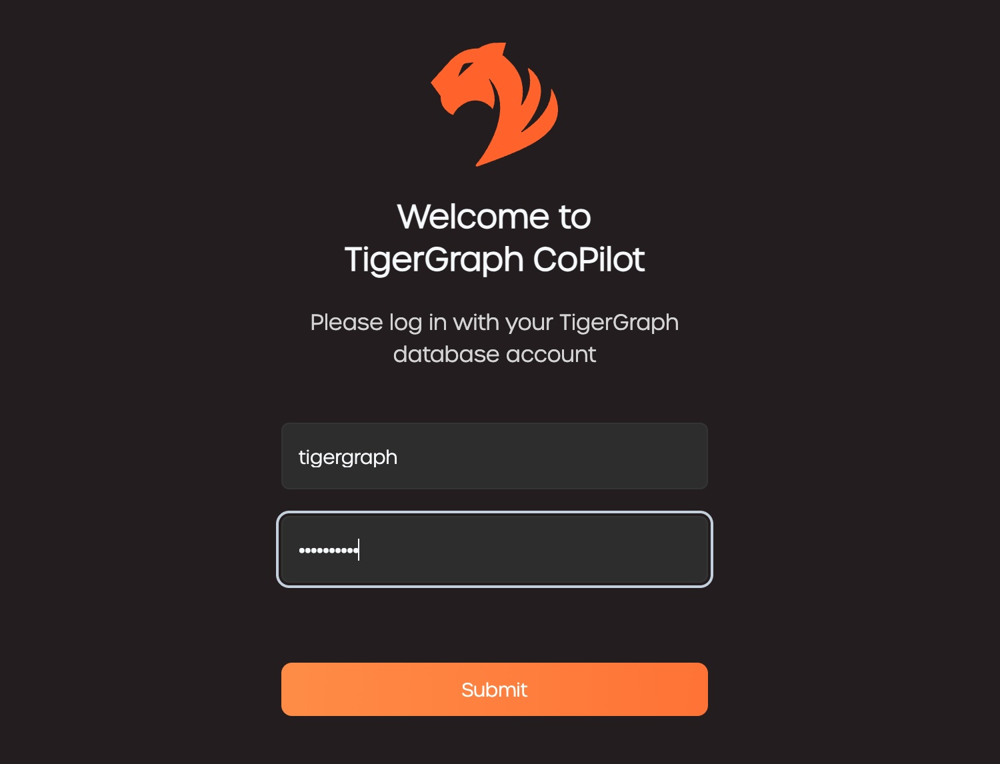
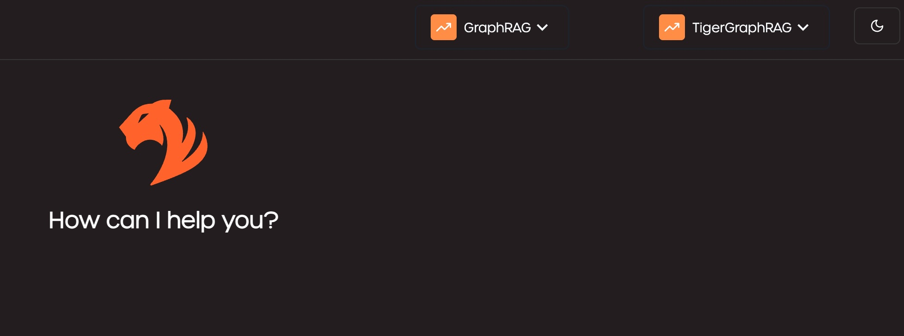
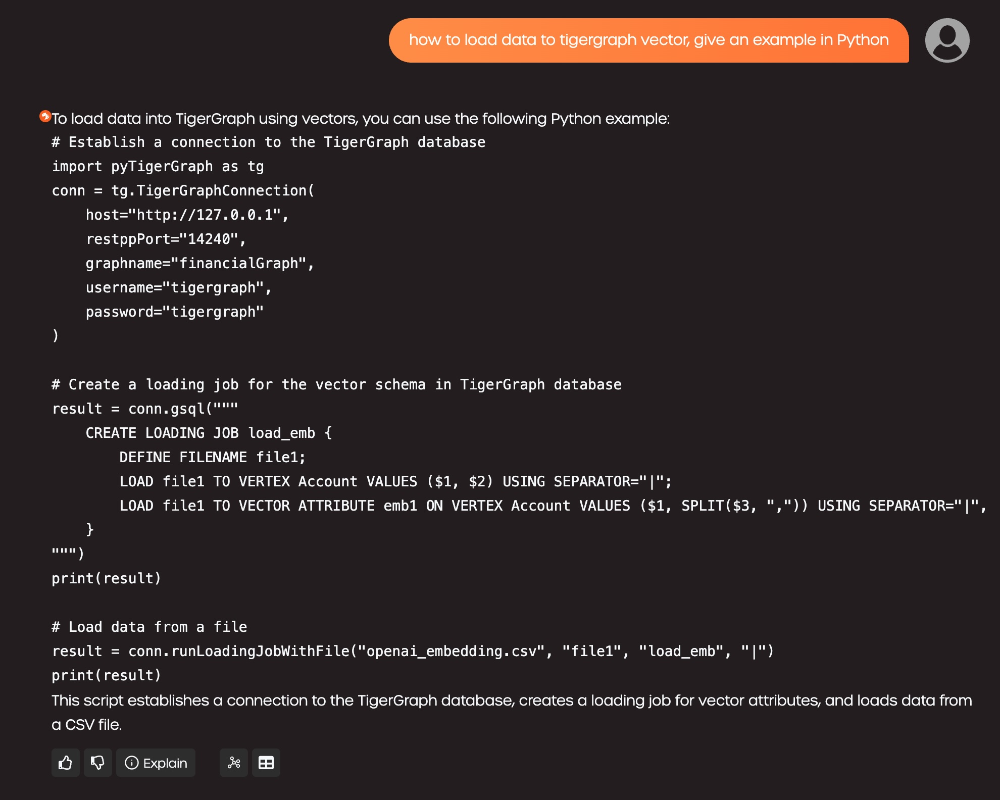

# Introduction

**TigerGraph CoPilot** is an AI assistant meticulously designed to combine the powers of graph databases and generative AI. It draws the most value from data and enhances productivity across various business functions, including analytics, development, and administrative tasks. It is one AI assistant with three core component services:
- **InquiryAI**: A natural language assistant for graph-powered solutions.
- **SupportAI**: A knowledge Q&A assistant for documents and graphs.
- **QueryAI**: A GSQL code generator, including query and schema generation, data mapping, and more (*Not available in Beta; coming soon*).

This document provides instructions on how to use **SupportAI**.

# Content

This CoPilot tutorial contains:
- [Setup Environment](#setup-environment)
  - [Setup Docker Environment](#setup-docker-environment)
  - [Download Docker Images](#download-docker-images)
  - [Deploy CoPilot Services](#deploy-copilot-with-docker-compose)
- [Run Demo](#run-demo)
  - [Use Preloaded GraphRAG](#use-preloaded-graphrag)
  - [Start From Scratch](#build-graphrag-from-scratch)
- [Detailed Configurations](#more-detailed-configurations)
  - [DB Configuration](#db-configuration)
  - [LLM Provider Configuration](#llm-provider-configuration)
  - [Chat Configuration](#chat-configuration)
      
# Setup Environment 

### Setup Docker Environment

* Follow [Docker setup ](https://github.com/tigergraph/ecosys/blob/master/demos/guru_scripts/docker/README.md) to set up your docker Environment.
* Please follow (Overview of installing Docker Compose)[https://docs.docker.com/compose/install/] to install Docker Compose for your platform accordingly.

### Download Docker Images

#### TigerGraph Docker Image

To use TigerGraph Community Edition without a license key, download the corresponding docker image from https://dl.tigergraph.com/ and load to Docker:
```
docker load -i ./tigergraph-4.2.0-alpha-community-docker-image.tar.gz
docker images
```

You should be able to find `tigergraph/community:4.2.0-alpha` in the image list.

#### CoPilot Docker Images

The following images are also needed for TigerGraph CoPilot. Docker Compose will automatically download them, but you can download them manually if preferred:

```
docker pull <image_name>

tigergraphml/copilot:latest
tigergraphml/ecc:latest
tigergraphml/chat-history:latest
tigergraphml/copilot-ui:latest
nginx:latest
```

### Deploy Copilot with Docker Compose

* Step 1: Get docker-compose file
- Download the [docker-compose.yml](https://github.com/tigergraph/ecosys/blob/master/tutorials/copilot/docker-compose.yml) file directly

The Docker Compose file contains all dependencies for CoPilot including a TigerGraph database. If you want to use a separate TigerGraph instance, you can comment out the `tigergraph` section from the docker compose file and restart all services. However, please follow the instructions below to make sure your standalone TigerGraph server is accessible from other Copilot containers.

* Step 2: Set up configurations

Next, download the following configuration files and put them in a `configs` subdirectory of the directory contains the Docker Compose file:
* [configs/db_config.json](https://github.com/tigergraph/ecosys/blob/master/tutorials/copilot/configs/db_config.json)
* [configs/llm_config.json](https://github.com/tigergraph/ecosys/blob/master/tutorials/copilot/configs/db_config.json)
* [configs/chat_config.json](https://github.com/tigergraph/ecosys/blob/master/tutorials/copilot/configs/db_config.json)
* [configs/nginx.config](https://github.com/tigergraph/ecosys/blob/master/tutorials/copilot/configs/nginx.config)

* Step 3: Adjust configurations

Edit `configs/llm_config.json` and replace `<YOUR_OPENAI_API_KEY>` to your own OPENAI_API_KEY. 
 
If desired, you can also change the model to be used for the embedding service and completion service to your preferred models to adjust the output from the LLM service.

* Step 4: Start all services

Now, simply run `docker compose up -d` and wait for all the services to start.

[Go back to top](#top)

### Standalone TigerGraph instance (Optional)

> **_Note:_** Vector feature preview is available in both TigerGraph Community Edition (Alpha) and Enterprise Edition (Preview).

If you prefer to start a TigerGraph Community Edition instance without a license key, please make sure the container can be accessed from the Copilot containers by add `--network copilot_default`:
```
docker run -d -p 14240:14240 --name tigergraph --ulimit nofile=1000000:1000000 --init --network copilot_default -t tigergraph/community:4.2.0-alpha
```

> Setting up **DNS** or `/etc/hosts` properly is an alternative solution to ensure contains can connect to each other.

Check the service status with the following commands:
```
docker exec -it tigergraph /bin/bash
gadmin status
gadmin start all
```

After using the database, and you want to shutdown it, use the following shell commmand
>```
>gadmin stop all
>```

[Go back to top](#top)

# Run Demo

### Use Preloaded GraphRAG

The completed `TigerGraphRAG` is provided for an express access to the Copilot features.

#### Step 1: Get data package

Download the following data file and put it under `/home/tigergraph/copilot` in your TigerGraph container:
* [data/ExportedGraph.zip](https://github.com/tigergraph/ecosys/blob/master/tutorials/copilot/data/ExportedGraph.zip)

Use the following commands if the file cannot be downloaded inside the TigerGraph container directly:
```
docker cp ExportedGraph.zip tigergraph:/home/tigergraph/copilot
docker exec -u 0 -it tigergraph chown tigergraph:tigergraph /home/tigergraph/copilot/ExportedGraph.zip
```

#### Step 2: Import data package
Next, log onto the TigerGraph instance and make use of the Database Import feature to recreate the GraphRAG:
```
docker exec -it tigergraph
gsql "import graph all from \"/home/tigergraph/copilot\""
gsql "install query all"
```

Wait until the following output is given:
```
[======================================================================================================] 100% (26/26)
Query installation finished.
```

#### Step 3: Run the demo via chat
Open your browser to access `http://localhost:<nginx_port>` to access Copilot Chat. For example: http://localhost:80

Enter the username and password of the TigerGraph database to login.



On the top of the page, select `GraphRAG` as RAG pattern and `TigerGraphRAG` as Graph.


In the chat box, input the question `how to load data to tigergraph vector store, give an example in Python` and click the `send` button.



### Build GraphRAG From Scratch

If you want to experience the whole process of Copilot, you can build the GraphRAG from scratch. However, please review the LLM model and service setting carefully because it will cost some money to re-generate embedding and data structure for the raw data.

#### Step 1: Get demo script

The following scripts are needed to run the demo. Please download and put them in the same directory as the Docker Compose file:
* Demo driver: [supportai_demo.sh](https://github.com/tigergraph/ecosys/blob/master/tutorials/copilot/supportai_demo.sh)
* SupportAI initializer: [init_supportai.py](https://github.com/tigergraph/ecosys/blob/master/tutorials/copilot/init_supportai.py)
* Example: [answer_question.py](https://github.com/tigergraph/ecosys/blob/master/tutorials/copilot/answer_question.py)

#### Step 2: Download the demo data

Next, download the following data file and put it in a `data` subdirectory of the directory contains the Docker Compose file:
* [data/tg_tutorials.jsonl](https://github.com/tigergraph/ecosys/blob/master/tutorials/copilot/data/tg_tutorials.jsonl)

#### Step 3: Run the demo driver script

> Note: Python 3.11+ is needed to run the demo
>
> It is recommended to use a virtual env to isolate the runtime environment for the demo
> ```
> python3.11 -m venv demo
> source demo/bin/activate
> ```

Now, simply run the demo script to try Copilot.
```
  ./supportai_demo.sh
```

The script will:
1. Check the environment
1. Init TigerGraph schema and related queries needed
1. Load the sample data
1. Init the GraphRAG based on the graph and install required queries
1. Ask a question via Python to get answer from Copilot

[Go back to top](#top)

# Detailed Configurations

### DB configuration
Copy the below into `configs/db_config.json` and edit the `hostname` and `getToken` fields to match your database's configuration. If token authentication is enabled in TigerGraph, set `getToken` to `true`. Set the timeout, memory threshold, and thread limit parameters as desired to control how much of the database's resources are consumed when answering a question.

`embedding_store` selects the vector db to use, currently supports `tigergraph` and `milvus`. Set `reuse_embedding` to `true` will skip re-generating the embedding if it already exists.

`ecc` and `chat_history_api` are the addresses of internal components of CoPilot.If you use the Docker Compose file as is, you don’t need to change them.

```json
{
    "hostname": "http://tigergraph",
    "restppPort": "14240",
    "gsPort": "14240",
    "getToken": false,
    "default_timeout": 300,
    "default_mem_threshold": 5000,
    "default_thread_limit": 8,
    "embedding_store": "tigergraph",
    "reuse_embedding": true,
    "ecc": "http://eventual-consistency-service:8001",
    "chat_history_api": "http://chat-history:80
}
```

### LLM provider configuration
In the `configs/llm_config.json` file, copy JSON config template from below for your LLM provider, and fill out the appropriate fields. Only one provider is needed.

* OpenAI

In addition to the `OPENAI_API_KEY`, `llm_model` and `model_name` can be edited to match your specific configuration details.

```json
{
    "model_name": "GPT-4",
    "embedding_service": {
        "embedding_model_service": "openai",
        "authentication_configuration": {
            "OPENAI_API_KEY": "<YOUR_OPENAI_API_KEY>"
        }
    },
    "completion_service": {
        "llm_service": "openai",
        "llm_model": "gpt-4-0613",
        "authentication_configuration": {
            "OPENAI_API_KEY": "<YOUR_OPENAI_API_KEY>"
        },
        "model_kwargs": {
            "temperature": 0
        },
        "prompt_path": "./common/prompts/openai_gpt4/"
    }
}
```

### Chat configuration
Copy the below code into `configs/chat_config.json`. You shouldn’t need to change anything unless you change the port of the chat history service in the Docker Compose file.
```json
{
    "apiPort":"8002",
    "dbPath": "chats.db",
    "dbLogPath": "db.log",
    "logPath": "requestLogs.jsonl",
    "conversationAccessRoles": ["superuser", "globaldesigner"]
}
```

[Go back to top](#top)

