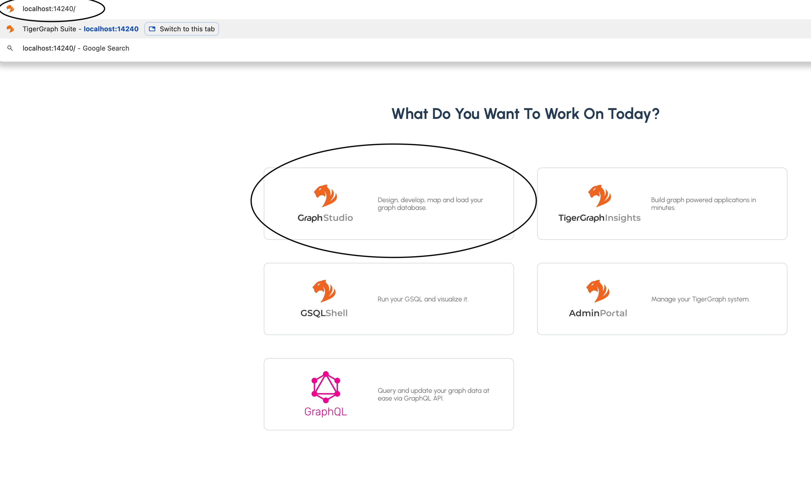

# Sample Graph For Tutorial
This graph is a simplifed version of a real-world financial transaction graph. There are 5 _Account_ vertices, with 8 _transfer_ edges between Accounts. An account may be associated with a _City_ and a _Phone_.
The use case is to analyze which other accounts are connected to 'blocked' accounts.


# How To Use GraphStudio

After installing TigerGraph, the `gadmin` command-line tool is automatically included, enabling you to easily start or stop services directly from your bash terminal.
```python
   docker load -i ./tigergraph-4.2.0-alpha-community-docker-image.tar.gz # the xxx.gz file name are what you have downloaded. Change the gz file name depending on what you have downloaded
   docker images #find image id
   docker run -d -p 14240:14240 --name mySandbox imageId #start a container, name it “mySandbox” using the image id you see from previous command
   docker exec -it mySandbox /bin/bash #start a shell on this container. 
   gadmin start all  #start all tigergraph component services
   gadmin status #should see all services are up.
```

In your chrome browser, type `http://localhost:14240`. 



